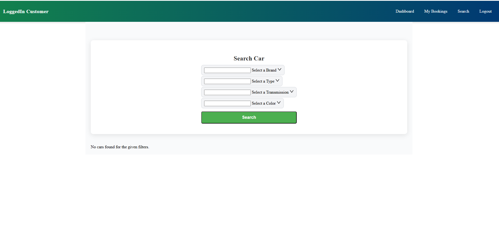
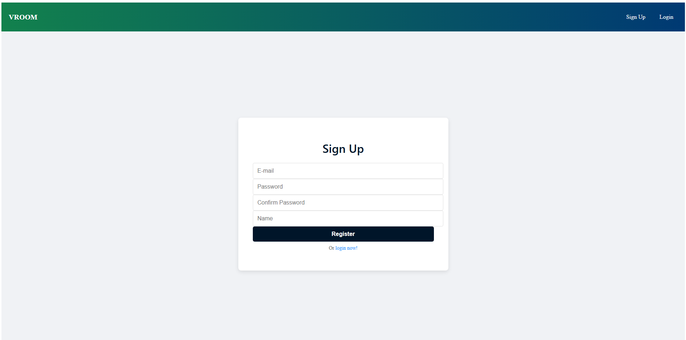
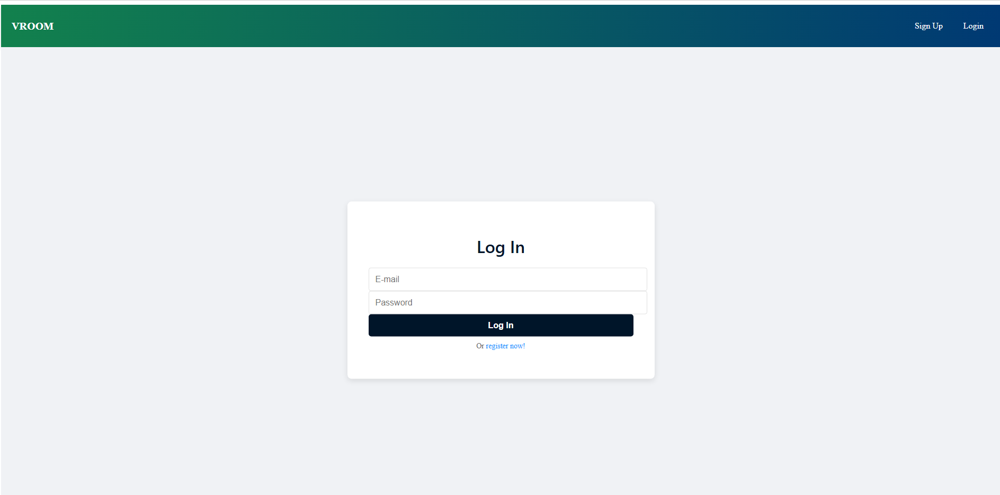
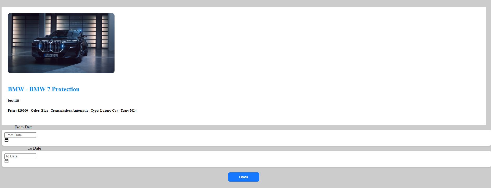
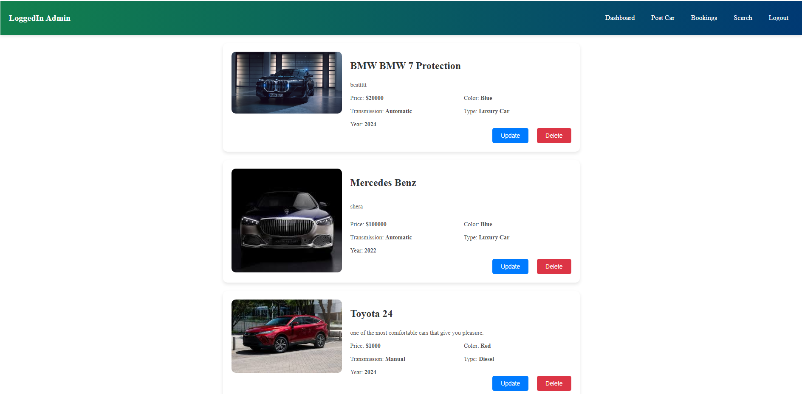
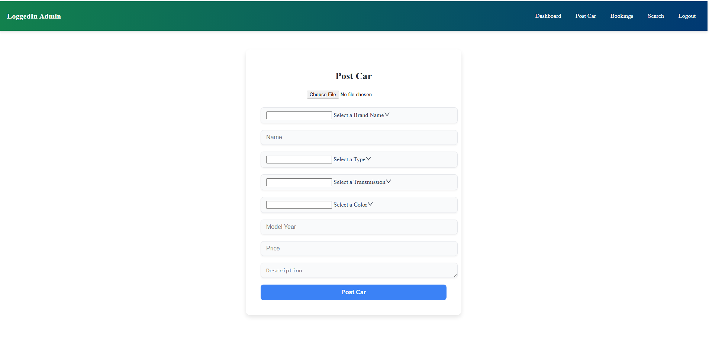
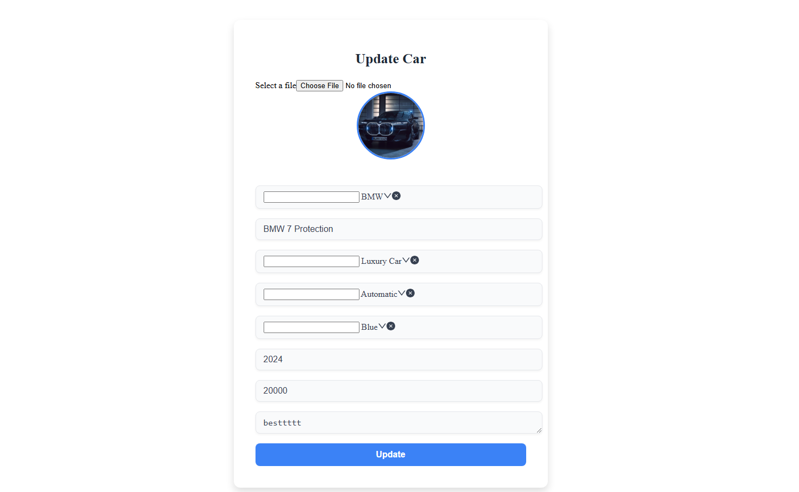

# VROOM: Vehicle Rental Online Operation Management

**VROOM** is a web application designed to simplify the management of vehicle rentals. It offers an intuitive interface for users to browse and rent vehicles and equips administrators with powerful tools to oversee and manage operations.

## 🌟 Features and Functionalities

Here’s the revised version of your **User Features** and **Admin Features** sections, now including image locations for each feature:

---

### **User Features**
- **Vehicle Search & Filter**:
  - Easily search for vehicles .
  - Use filters to sort vehicles by price range, features, and availability, helping users find the perfect match.
  
    

- **Account Management**:
  - Create a secure account or log in to manage personal details.
  - View rental history, edit profile information, and track current bookings in one place.
  
    
    
  
- **Booking **:
  - Book vehicles in real-time, ensuring instant reservation confirmation.
  - View detailed booking information and rental terms on the user dashboard.

    

---

### **Admin Features**
- **Dashboard Overview**:
  - Get an overview of all critical metrics, including total rentals, revenue, active vehicles, and user activity.
  - Monitor real-time data to stay updated on the platform’s operations.

    

- **Vehicle Management**:
  - Admins can add new vehicles to the inventory, update vehicle details, and remove outdated or damaged vehicles.
  - Change vehicle status (e.g., available, rented, under maintenance) as required.
  
    
    


- **Booking Oversight**:
  - View, approve, or decline bookings made by customers.
  - Generate detailed reports on rentals and user activity to better manage the platform.

    

- **Payment Management**:
  - Monitor and reconcile payments, ensuring secure transactions and timely revenue processing.
  - Resolve payment disputes or errors effectively.

- **Vehicle Search & Filter**:
  - Easily search for vehicles .
  - Use filters to sort vehicles by price range, features, and availability, helping users find the perfect match.
  
    

## 🛠️ Technologies Used

- **Frontend**: HTML, CSS, Angular
- **Backend**:SpringBoot java
- **Database**: MySQL 
- **Version Control**: Git and GitHub
- **Hosting**: [GitHub Pages](https://nuhb008.github.io/VROOM_/) 


## 🔧 Installation and Setup

1. Clone the repository:
   ```bash
   git clone https://github.com/nuhb008/VROOM_
   cd VROOM_
   ```

2. Install dependencies:
   ```bash
   npm install
   ```

3. Configure environment variables:
   - Create a `.env` file in the root directory.
   - Add variables like database URL, payment gateway keys, etc.

4. Start the development server:
   ```bash
   ng serve
   ```

5. Access the app in your browser:
   ```
   http://localhost:3000
   ```

## 📄 License

This project is licensed under the [MIT License](LICENSE). You are free to use, modify, and distribute this code under the license terms.

---

